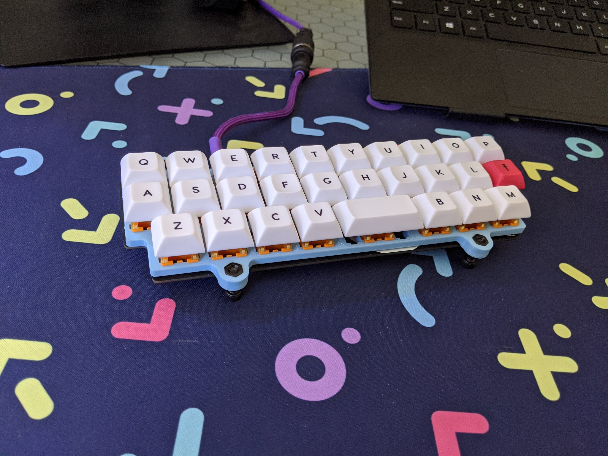

# Alpha-28 Lowest Profile Case

Lowest-profile case possible for Alpha 28

## Assembly

The case is assembled using M5 screws.  Nuts should be seated in the recessed holes on the top of the case as well as placed underneath the case to hold it in place.  

```
     #      --> nut
    ___     --> case
     #      --> nut
     |
     ^      --> screw head
```

I've also included some feet that fit into the M5 screws as well. You can place rubber pads on these to prevent the keyboard from sliding around.
Here is a link to the pads I use : <https://www.amazon.com/gp/product/B06XCLYL53/ref=ppx_yo_dt_b_asin_title_o00_s01?ie=UTF8&psc=1>
